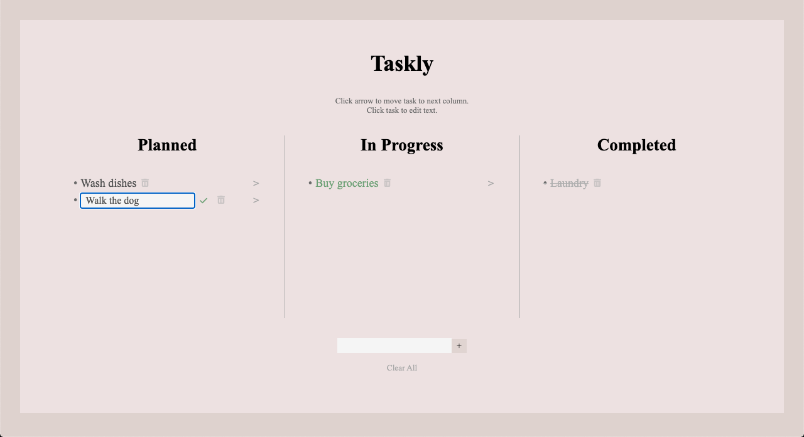

# Taskly

Taskly is a simple task managing app that allows users to add, edit, delete, and organize tasks into different sections.

### Features

- User can add a new task
- User can move a task from Planned > In Progress > Completed
- User can edit a task
- User can delete a task
- User can "Clear All" tasks
- User data is saved in the cloud

### Technologies

- HTML
- CSS
- Node.js
- Express
- MongoDB
- React

### Try It Out

[Taskly](https://taskly-react.herokuapp.com/)

### Visuals

